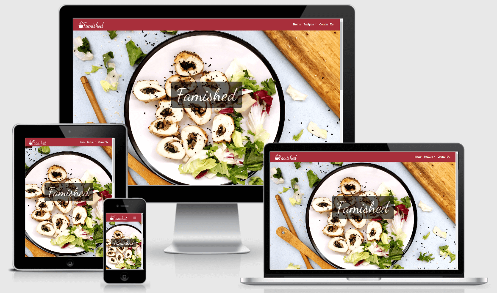

# Famished - Recipe Website

[View the live project here.](https://farrelleoin93.github.io/Milestone-3-Recipe-Site/)

This is a recipe website. It is designed to be useful for people with different levels of abilities in the kitchen, from complete novice to experienced cook. It is also designed to be easy to navigate for users of all ages.

## Contents

---

- [UX](#ux)
  - [User Stories](#user-stories)
  - [Site Owner Goals](#goals)
  - [User Requirements and Expectations](#user-requirements)
  - [Design Choices](#design-choices)
    - Fonts
    - Icons
    - Colours
- [Wireframes](#wireframes)
- [Features](#features)
- [Technologies](#technologies)
- [Testing](#testing)
- [Bugs](#bugs)
- [Deployment](#deployment)
- [Credits](#credits)
- [Acknowledgements](#acknowledgements)

## <a name="ux">UX</a>

---

### <a name="user-stories">User Stories</a>

1. As a user, I want to understand what the site is for.
2. As a user, I want to be able to easily find recipes to cook matching my ability in the kitchen.
3. As a user, I want to be able to easily navigate through the site even on my first visit.
4. As a user, I want to be able to find recipes that I have seen on the site in the past.
5. As a user, I want to be able to contact the owner of the website.

### <a name="goals">Site Owner Goals</a>

1. As a site owner, I want to be able to supply aspiring cooks with recipes suitable for beginners.
2. As a site owner, I want to be able to supply recipes to people with all levels of cooking abilities.
3. As a site owner, I want to able to answer any questions that site users might have.
4. As a site owner, I want to increase the volume of people visiting this site.

## <a name="user-requirements">User Requirements and Expectations</a>

---

### Requirements

- Be presented with a visually appealing website.
- Be able to easily navigate through the website using the navbar.
- Be provided with recipes that their cooking ability allows them to prepare.
- Have a working contact form.

### Expectations

- A visually pleasing website that is informative and serves their individual needs.
- A working nabar bar that leads them to the area of the website that they wanted to reach.
- Pictures that accurately show the finished result of the recipes.

## <a name="design-choices">Design Choices</a>

---

### Fonts

When I started this project I had intended on using [Roboto](https://fonts.google.com/specimen/Roboto)
 for the headings and navbar links. I also had planned on using [Nunito](https://fonts.google.com/specimen/Nunito?query=nunito) 
for the paragraphs. However, I was unhappy with how these fonts looked so I decided to use [Domine](https://fonts.google.com/specimen/Domine?query=domine) for the headings and the navbar links.
I then used [Roboto](https://fonts.google.com/specimen/Roboto) for the paragraphs.

### Colours

- Originally for the header and footer I was planning on using a green as it reminded me of fresh ingrdients which I felt was fitting for a recipe website.
However, I was not happy with how it looked so I instead decided to go with a maroon to match the marroon coloured salad leaves in the main image on the home page.
- To contrast this I chose white #fff for the background colour of the body.
- I also used white #fff for the font in the header and footer as I felt it worked well with the shade of maroon that I used.
- For the headings and paragraphs in the main body I used a grey #545b62.

### Icons

The icons that I used in this project were provided by [Font Awesome](https://fontawesome.com/).

## <a name="wireframes">Wireframes</a>

---

### Original Wireframes

The original wireframes from before I started to build my website can be found at the following links:

- [Home Page](https://github.com/farrelleoin93/Milestone-3-Recipe-Site/blob/master/assets/docs/Home-page-wireframes.pdf)

- [Recipe Choice Page](https://github.com/farrelleoin93/Milestone-3-Recipe-Site/blob/master/assets/docs/Recipe-choice-page.pdf)

- [Recipe Pages](https://github.com/farrelleoin93/Milestone-3-Recipe-Site/blob/master/assets/docs/Recipe-page.pdf)

- [Contact](https://github.com/farrelleoin93/Milestone-3-Recipe-Site/blob/master/assets/docs/Contact-page.pdf)

#### Changes to Original Wireframes

- All Pages
  - The page links in the footer were removed. Since the header was fixed to the top there was no need to have these links in the footer. This change came from advice I recieved from my mentor Akshat Garg.
- Home Page
  - "Famished" text box was added to the center of the hero image as the page looked a bit plain without it. This change came from advice I recieved from my mentor Akshat Garg.
  - Hero image was included on mobile device. This was a result of advice I recieved on my post in peer-code-review on slack from Alexeykuz and Liga.
- Recipe Pages
  - The ingredients and Instructions sections were stacked on top of eachother on desktops as It appeared more balanced than it did side by side. This change came from advice I recieved from my mentor Akshat Garg.
  

## <a name="features">Features</a>

---

The main features that I want this website to have are:
- an attractive design.
- easily understandable navigation on different screen sizes.
- links to social media platforms.
- a contact us form.

Features that will be added in the future:
- videos of each dish being made.
- a way to change the amount of ingredients depending on how many people the dish will serve.
- a way to change the volume metrics eg. 1 pint/500ml.

## <a name="technologies">Technologies</a>

---

### Languages

- [HTML5](https://en.wikipedia.org/wiki/HTML5) 
- [CSS3](https://en.wikipedia.org/wiki/CSS)

### Other

- [Tiny PNG](https://tinypng.com/)
- [Font Awesome](https://fontawesome.com/)
- [Ucraft](https://www.ucraft.com/free-logo-maker)
- [Bootstrap 4.5](https://getbootstrap.com/)
- [Google Fonts](https://fonts.google.com/)
- [Balsamiq](https://balsamiq.com/)
- [Github](https://github.com/)
- [Gitpod](https://www.gitpod.io/)
- [Chrome DevTools](https://developers.google.com/web/tools/chrome-devtools)

## <a name="testing">Testing</a>

---

1. All html pages were passed through [W3C Markup Validation Service](https://validator.w3.org/) and the results are as follows:
     - *index.html* - "Document checking completed. No errors or warnings to show."
     - *contact.html* - "Document checking completed. No errors or warnings to show."
     - *starter-recipes.html* - "Document checking completed. No errors or warnings to show."
     - *mains-recipes.html* - "Document checking completed. No errors or warnings to show."
     - *desserts-recipes.html* - "Document checking completed. No errors or warnings to show."

         When I first passed the rest of the html pages through the validator they all had the same three errors show up as they all use the same template since they are the recipe pages.
         The errors that shoed up are as follows:
     1. "Error: Bad value 80% for attribute width on element img: Expected a digit but saw % instead."
     2. "Error: Bad value auto for attribute height on element img: Expected a digit but saw a instead."
     3. "Error: No p element in scope but a p end tag seen."

         I then made the appropriate changes and passed the pages through the validator again and the results were as follows:
     - bagels.html - "Document checking completed. No errors or warnings to show."
     - brownies.html - "Document checking completed. No errors or warnings to show."
     - cheesecake.html - "Document checking completed. No errors or warnings to show."
     - cookies.html - "Document checking completed. No errors or warnings to show."
     - curry.html - "Document checking completed. No errors or warnings to show."
     - dumplings.html - "Document checking completed. No errors or warnings to show."
     - meatballs.html - "Document checking completed. No errors or warnings to show."
     - pasta.html - "Document checking completed. No errors or warnings to show."
     - rings.html - "Document checking completed. No errors or warnings to show."

2. The style.css file was passed through [W3C CSS Validation Service](https://jigsaw.w3.org/css-validator/#validate_by_input) and got the result: "Congratulations! No Error Found."

3. I used the Lighthouse function in DevTools and following the results  I used [TinyPNG](https://tinypng.com/) to reduce the size of all images to improve the speed of my webiste.
Although It also suggested that my colouring scheme was not contrasting enough I decided to not change this as I am happy with the overall look of the website.

4. Further Testing
  - This site was tested on the following browsers: Google Chrome. Microsoft Edge, Internet Explorer and Safari.
  - This website was tested on multiple devices, including: Desktop, iPad, iPhone 5/6/7/8/X, Samsung Galaxy S5.
  - I also asked my friends to test out my the websie and report any bugs that they found.
  - All links were tested.
  - I applied Unicorn Revealer to all pages.

5. User Stories
     - *As a user, I want to understand what the site is for.* - I feel that this was achieved by the us of the hero image on the hom page and the brief description below this image. 
     - *As a user, I want to be able to easily find recipes to cook matching my ability in the kitchen.* - I feel that this was achieved by choosing recipes of different difficulty to feature on the site.
     - *As a user, I want to be able to easily navigate through the site even on my first visit.* - I feel that this was achieved by the clear and self-explanatory links on each page.
     - *As a user, I want to be able to find recipes that I have seen on the site in the past.* - I feel that this was achieved by placing all recipes in pages that are labelled as the type of course that matches them.
     - *As a user, I want to be able to contact the owner of the website.* - I feel that this was achieved by the form on the contact us page.

6. Site Owner Goals
     - *As a site owner, I want to be able to supply aspiring cooks with recipes suitable for beginners.* - I feel that this was achieved by providing a recipe that is easy to navigate and use lots of images of appealing dishes. 
     - *As a site owner, I want to be able to supply recipes to people with all levels of cooking abilities.* - I feel that this was achieved by  choosing recipes of different difficulty to feature on the site.
     - *As a site owner, I want to able to answer any questions that site users might have.* - I feel that this was achieved by the form on the contact us page.
     - *As a site owner, I want to increase the volume of people visiting this site.* - I feel that this was achieved by providing a recipe that is easy to navigate and use lots of images of appealing dishes.

## <a name="bugs">Bugs</a>

---

1. When I first passed the recipe pages through he HTML validator I got the following errors:
     - "Error: Bad value 80% for attribute width on element img: Expected a digit but saw % instead."
     This was solved by creating a div element and applying the width value in the style.css file instead.
     - "Error: Bad value auto for attribute height on element img: Expected a digit but saw a instead."
     This was solved by creating a div element and applying the width value in the style.css file instead.
     - "Error: No p element in scope but a p end tag seen."
     This was solved by replacing the p element with a div.

2. I had a small bit of horizontal scroll on my pages, this was solved by by using Unicorn Revealer to find some unwanted margins.

## <a name="deployment">Deployment</a>

---

To deploy this project from its GitHub repository to GitHub Pages the following steps were taken:
1. From the projects repository I clicked on **Settings**.
2. I then scrolled down to the **GitHub Pages** section.
3. Within **Source** I clicked on the **Branch** button and I chose **Master** in the dropdown menu.
4. I then clicked **Save** and refreshed the page. At that point my website was deployed.
5. I scrolled down to the **GitHub Pages** section again to retrieve the link.
## <a name="credits">Credits</a>

---

### Credits for Fonts

- [Google Fonts](https://fonts.google.com)
- [Font Pair](https://fontpair.co/)

### Media

1. All images were sourced from [Unsplashed](https://unsplash.com/), in particular from the following talented photographers: 
- Mae Mu 
- Jennifer Pallain
- Amber Engle
- Joe Darams
- Tara Evans
- Charles Deluvio
- Bruna Branco
- Jason Leung
- Michelle Tsang
- Kosma Kurlowics
- Ala
- Alex Loup

2. I used [Tiny PNG](https://tinypng.com/) to reduce the size of each image.

3. I used [Font Awesome](https://fontawesome.com/) for all the icons in this project.

4. The logo for this project was made using [Ucraft](https://www.ucraft.com/free-logo-maker).

### Code 
1. [Bootstrap](https://getbootstrap.com/docs/4.5/getting-started/introduction/) - Code for navbar and button was found on Bootstrap [here](https://getbootstrap.com/docs/4.5/components/navbar/) and adapted for this project.

2. [W3Schools](https://www.w3schools.com/) - Some code snippets for the hero image were found [here](https://www.w3schools.com/) and also general help throughout this project was provided by W3Schools. 

3. [CSS-Tricks](https://css-tricks.com/) - Guidance for flexbox was found [here](https://css-tricks.com/snippets/css/a-guide-to-flexbox/) and also guidence on how to fix the footer to the bottom of the page was found [here](https://css-tricks.com/couple-takes-sticky-footer/).

### Content
The information sections on each recipe page were found on the following websites and written by the following Authors:

- Bagels - [Sophisticated Gourmet](https://www.sophisticatedgourmet.com/2009/10/new-york-style-bagel-recipe/) by Kamran Siddiqi

- Onion Rings - [My Latina Table](https://www.mylatinatable.com/homemade-extra-crispy-onion-rings/) by Charbel Barker

- Pork and Cabbage Dumplings - [Serious Eats](https://www.seriouseats.com/recipes/2015/03/the-best-japanese-pork-and-cabbage-dumplings-gyoza-recipe.html) by J. Kenji López-Alt

- Cauliflower Curry - [Minimalist Baker](https://minimalistbaker.com/1-pot-yellow-chickpea-cauliflower-curry/) by Minimalist Baker

- Hake and Crab Linguine - [What Dad Cooker](https://minimalistbaker.com/1-pot-yellow-chickpea-cauliflower-curry/#wprm-recipe-container-34106) by What Dad Cooked

- Meatballs - [Cooking Classy](https://www.cookingclassy.com/meatball-recipe/) by Jaclyn

- Chocolate Brownies - [Recipe Tin Eats](https://www.recipetineats.com/easy-chocolate-brownies/) by Nagl

- Baked Vanilla Cheesecake - [Sallys Baking Addiction](https://sallysbakingaddiction.com/classic-cheesecake/) by Sally

- Chocolate Chip Cookies- [Joy Food Sunshine](https://joyfoodsunshine.com/the-most-amazing-chocolate-chip-cookies/) by Laura

## <a name="acknowledgements">Acknowledgements</a>

- I would like to thank my mentor Akshat Garg, for lots of invaluable advice.
- I would like to give a special thanks to Alexeykuz and Liga for taking the time to test out my website and provide me with advice when I posted in peer-code-review on slack.
- Also I would like to thank the Slack community at large, as I was able to find help with some small issues that I had during this project by just doing a simple search.
- I would like to thank JimLynx_Lead for hosting the MS1 Preperation Webinar as it really got me going on project at a time when starting seemed very overwhelming.